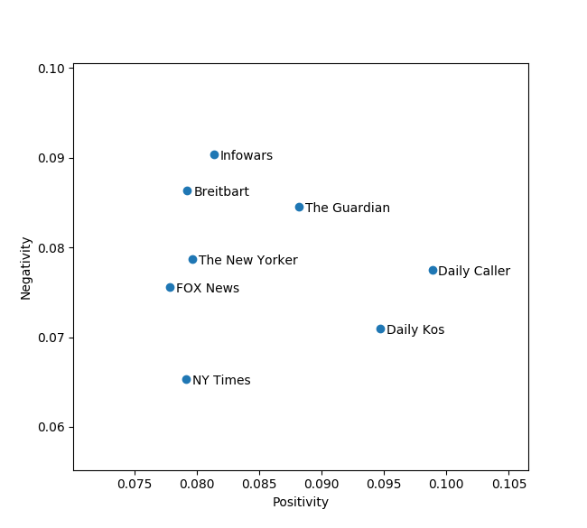
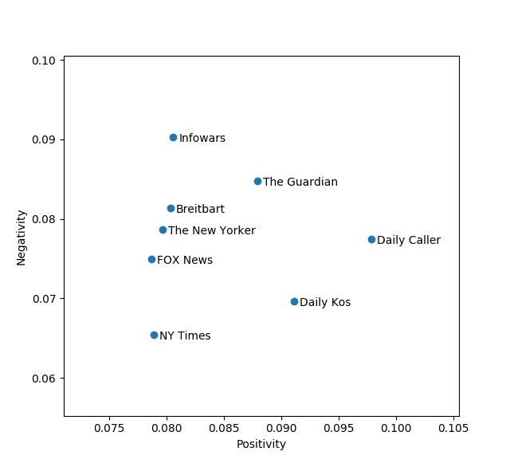

# News Sentiment Analyzer

For my [Software Design Mini Project 3](https://sd17spring.github.io/assignments/mini-project-3-text-mining/), I decided to analyze articles from various biased online news sources and compare the positivity and negativity of each. The program fetches various sites' RSS feeds, scrapes the content of each article listed, runs it through [VADER Sentiment Analysis](https://github.com/cjhutto/vaderSentiment), and plots each source based on the positive and negative sentiment scores. I initially hoped to see if certain news outlets were significantly more negative than others.

### Implementation

The program is centered around two core components: the data fetcher and the content analyzer.

##### Data Fetching and Storing

The first component, `DataFetcher`, is responsible for taking a given RSS feed URL, fetching the XML, parsing it, and building up a list of `Source` objects, each with a list of content-less `Articles` associated with it. Next, `DataFetcher` loops through each article, checking to see if it has already been downloaded and saved to a local text file. If the article hasn't, it fetches the HTML and uses [BeautifulSoup](https://www.crummy.com/software/BeautifulSoup/) to pull out the content. Once all the content is downloaded and parsed, `NewsSentimentJSONEncoder` is used to convert the `Source` and its associated `Articles` to JSON before saving the result to a text file.

One design decision I made was to serialize my data using [JSON](https://docs.python.org/3/library/json.html) rather than [Pickle](https://docs.python.org/3/library/pickle.html). The decision was based on three primary factors: a) the [performance difference between JSON and Pickle](https://konstantin.blog/2010/pickle-vs-json-which-is-faster/) (I'd be dealing with a lot of text), b) the [security flaws with Pickle](https://lincolnloop.com/blog/playing-pickle-security/), and c) given the prior, it seemed it would be useful to know JSON serialization in Python for future projects where security might be more of a concern.

##### Analyzing Content

Once the old data has been loaded and all the latest articles have been downloaded, `TextAnalyzer` uses VADER Sentiment Analysis to compute a positivity, negativity, neutrality, and composite score for each source's collection of articles. It then returns these scores to the main module, which uses [matplotlib](http://matplotlib.org/) to display a labeled scatterplot of the positivity and negativity of each source.

### Results

My results surprised me. I expected to see more of a divide between left-wing and right-wing news outlets. However, as can be seen below, the points were fairly evenly interspersed. Running the test on different article sets shifted the location of some points but left others more or less the same.

               Run 1                    |              Run 2
:--------------------------------------:|:-----------------------------------:
  |  

It's hard to really come to a conclusion about the sites given the above plot though. First off, the "sentiment" of a sentence and the "sentiment" of the overall website are not necessarily highly correlated. The former is measuring the "positivity" and "negativity" of individual words and phrases in a sentence, while the latter would require more of an overarching analysis of the ideas presented and the emotions evoked in the reader. As such, while some sites's scores I could agree with (Infowars and Breitbart appear to be pretty negative), I wouldn't place any bets based on the scores for the other sites.

Also, one has to wonder what questions are even good to ask about news sites and their styles of writing. Different sites are targeted at different people, and different groups react to certain ideas and messages differently. What might be quite positive for one group could be quite negative for another. Therefore, I think I've unearthed at least a rough answer to my question, but I'm doubtful of whether or not it's a useful question to ask in the first place.

### Reflection

Overall, my project went pretty well. The sentiment analysis portion (given that I was using someone else's library) was quick and straightforward. Fetching and sorting through the XML and HTML took a little big longer, but the majority of my time (perhaps 60%) was spent writing and debugging the JSON encoder/decoder. In the future, it might be worthwhile to make some static resources (XML, HTML, JSON) to use for unit testing, as I really didn't do any of that since I was using dynamic resources.
